# Отчёт
# Конфигурирование HostName и создание пользователя

1. Для начала создаём три виртуальные машины

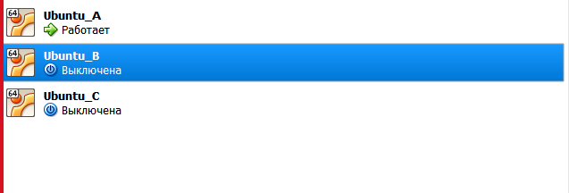

2. Сконфигурируем HostName (для Ubuntu_B) с помощью команды

```shell 
$ sudo hostnamectl set-hostname primak_gateway
$ sudo nano /etc/hostname 
```
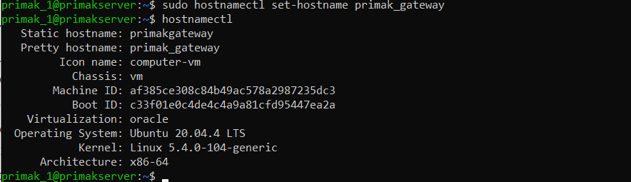

3. После этого добавляем ещё одного пользователя
```shell 
$ sudo adduser primak_2
```
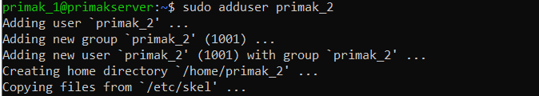

4. Перезагружаем машину. Тоже самое проделываем с Ubuntu_С.
Меняем название хоста на primak_client. Добавляем пользователя primak_3

# Конфигурирование виртуального интерфейса

1. Заполняем конфигурационный файл
```shell 
$ sudo vim /etc/netplan/00-installer-config.yaml
```
2. Ubuntu - A

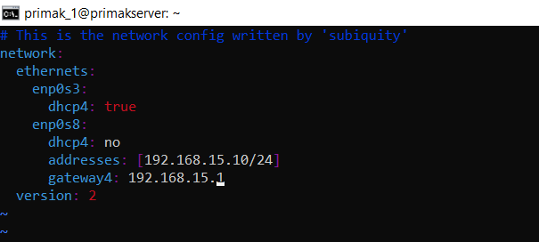

3. Проверяем на корректность и сохраняем файл

```shell 
$ sudo netplan --debug generate
$ sudo netplan apply
```
4. Ubuntu - B

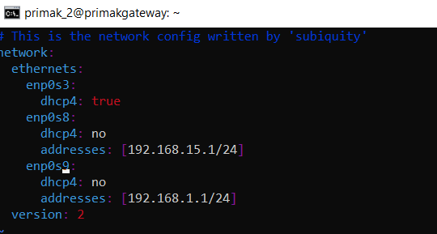

5. Ubuntu - C

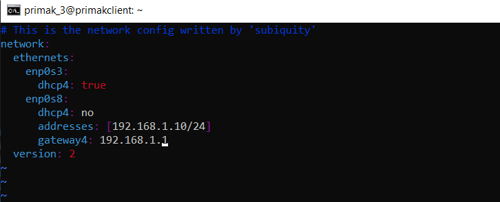

# Настройка шлюза

1. Разрешаем переброс пакетов на шлюзе

```shell 
$ sudo echo 1 | sudo tee /proc/sys/net/ipv4/ip_forward 1
```
Теперь server и client видят друг друга через шлюз. Раскомментируем данную строку: net.ipv4.ip_forward=1 в файле,
чтобы при перезапуске машин шлюз восстанавливал видимость

```shell 
$  sudo vim /etc/sysctl.conf 
```

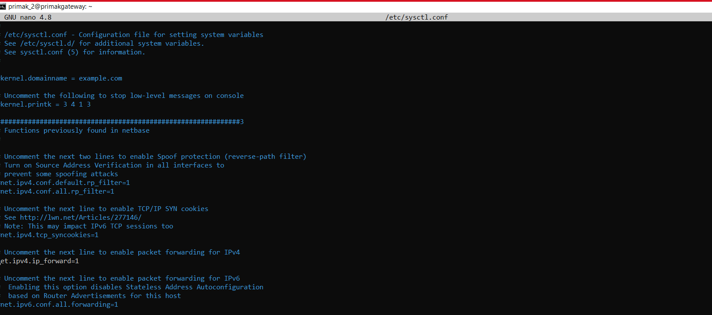

2. Настравиваем маршрут

```shell 
$ sudo iptables -A FORWARD -i enp0s9 -o enp0s8 -p tcp --syn --dport 5000 -m conntrack --ctstate NEW -j ACCEPT

$ sudo iptables -A FORWARD -i enp0s9 -o enp0s8 -m conntrack --ctstate ESTABLISHED,RELATED -j ACCEPT
$ sudo iptables -A FORWARD -i enp0s8 -o enp0s9 -m conntrack --ctstate ESTABLISHED,RELATED -j ACCEPT

$ sudo iptables -P FORWARD DROP

```

3. Сохраняем правила

```shell 
$ sudo apt-get install iptables-persistent
$ sudo iptables-save > /etc/iptables/rules.v4
$ sudo ip6tables-save > /etc/iptables/rules.v6
```
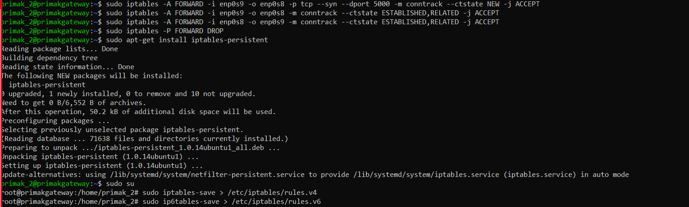


# Cервер

1. Создаём скрипт на python

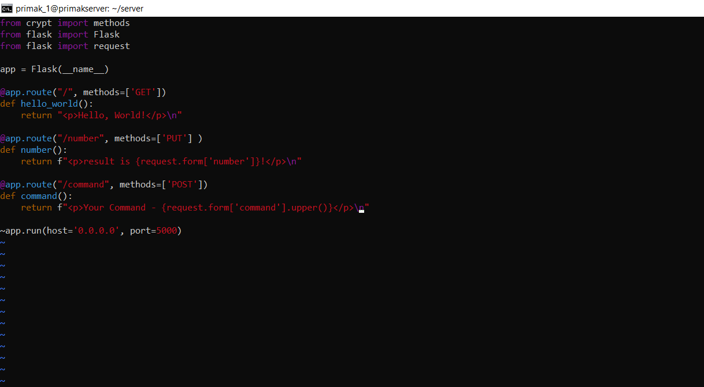

2. С помощью systemd создаём сервис, который запускает скрипт через автозагрузку

```shell 
$ sudo vim /lib/systemd/system/web-server.service
```
3. Записываем следующий скрипт

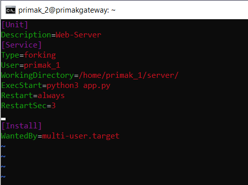

4. Перезапускаем службу и активируем автозагрузку 

```shell 
$ sudo systemctl daemon-reload
$ sudo systemctl start web-server
$ sudo systemctl enable web-server
$ sudo systemctl status web-server
```

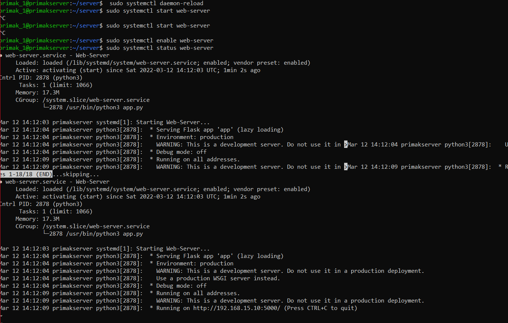


# Проверка работы 

1. На клиенте прописываем команды 

```shell 
$ curl 'http://192.168.15.10:5000/'
$ curl -X PUT -d number=5 192.168.15.10:5000/number
$ curl -X POST -d 'command=reboot' http://192.168.15.10:5000/command
```
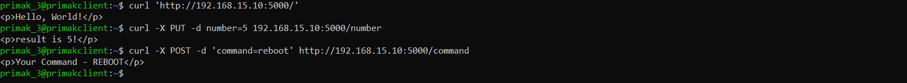


2. Проверим, что настроенные правила по маршуту пакетов работают корректно.

Во-первых, развёртываем на порту 5040 ещё один веб-сервер.

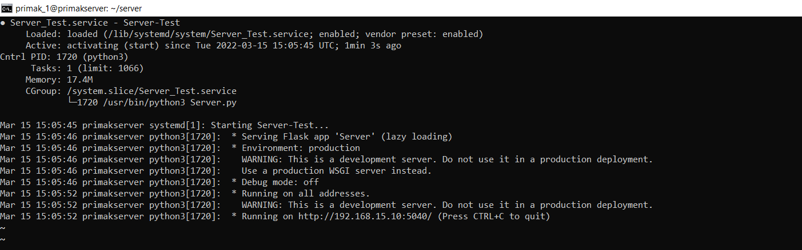

Во-вторых, используем команду tcpdump для проверки результов работы. Отправляем с клиента запросы на сервер.

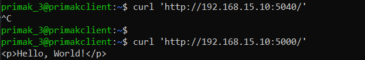

```shell 
$ sudo tcpdump -i enp0s9 tcp
```

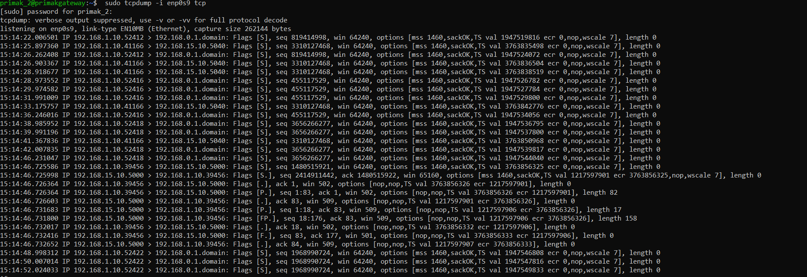

Как видно из результатов запроса, ответ на запрос клиента есть только по порту 5000. Фильтрация пакетов работает.


